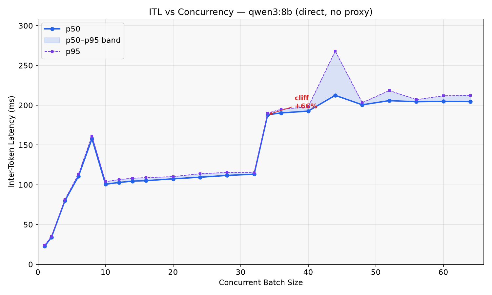
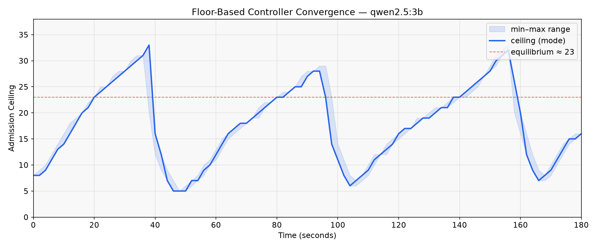

# Smoothie

A concurrency controller for LLM inference traffic. Sits in front of
llama.cpp, vLLM, or any OpenAI-compatible backend and caps concurrent
decode streams to maintain a per-stream token rate floor.

Built as a filter for [Praxis](https://github.com/usize/praxis), a
programmable HTTP proxy.

## How it works

Smoothie observes inter-token latency (ITL) from SSE chunks as they
stream through the proxy. An AIMD controller adjusts an admission
ceiling: requests above the ceiling get a fast 429, requests below it
pass through to the backend. The ceiling rises when ITL is healthy and
drops when it degrades.

The control signal is the median EWMA-smoothed ITL across all active
streams. Median (p50) is robust to single-stream outliers while
remaining sensitive to batch-wide shifts.

Overflow is shed as immediate 429s with `Retry-After` headers. No
queuing, no hidden latency. A separate circuit breaker handles backend
failures (5xx streaks).

## Performance

Tested with Qwen2.5-3B Q4 on Apple M4 Pro / llama.cpp:

```
batch   ITL p50    regime
    1    11ms      sequential, no batching benefit
    8    67ms      linear scaling, streams contend for bandwidth
   10    48ms      batching onset, ITL drops as llama.cpp batches efficiently
   32    57ms      plateau, ~1% ITL increase per +4 batch
   34    88ms      capacity cliff, +55% jump
   64   101ms      over capacity, gradual degradation
```

With `floor_tps: 12.0` (83ms target), the controller holds an
equilibrium of ~23 concurrent streams, staying in the efficient
plateau (B=10-34) where ITL is 48-57ms.





## Quick start

```bash
# Build
cargo build --release -p smoothie-server

# Run (with Ollama or llama-server on port 11434)
cargo run --release -p smoothie-server -- -c examples/configs/smoothie.yaml

# Benchmark your hardware
llama-server -m model.gguf --parallel 64 --port 8085 --ctx-size 65536 -ngl 99
python benchmarks/run_all.py --phase itl
```

## Configuration

```yaml
filters:
  - filter: smoothie
    floor_tps: 12.0          # per-stream decode rate floor (tok/s)
    headroom_ms: 10          # dead zone below floor before increasing
    beta: 0.8                # multiplicative decrease factor
    hysteresis_steps: 200    # observations before acting
    ceiling_min: 1
    ceiling_max: 64
    ewma_alpha: 0.3          # per-stream ITL smoothing
```

Set `floor_tps` based on your ITL sweep. The floor should sit above
the plateau ITL and below the cliff ITL. Use `benchmarks/run_all.py
--phase itl` to find these for your model and hardware.

Omit `floor_tps` entirely to enable derivative-based crossover
detection (experimental).

## License

MIT
